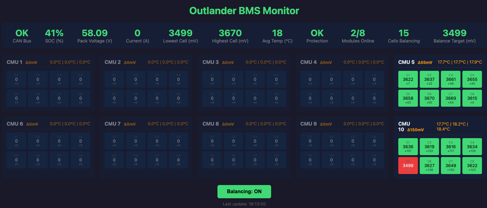

# Outlander PHEV BMS Reader for T-2Can

This is standalone PlatformIO firmware for the LilyGo T-2Can board (ESP32-S3).
It reads cell voltages and temperatures from Mitsubishi Outlander PHEV battery
modules over CAN and provides monitoring, balancing, MQTT telemetry, and a
physical safety permissive for DIY home energy storage.

## Current runtime contract (verified 20 August 2026)

The current firmware is a standalone CMU monitoring/safety controller. It reads CMU CAN data, controls balancing, publishes MQTT telemetry, and drives one physical permissive: GPIO15 `BATTERY_SAFE_TO_USE` (active HIGH). GPIO15 goes LOW for high temperature, no CAN data for 10 seconds, a selected CMU missing for 10 seconds, any cell at or above 4.20 V, or any cell at or below 2.80 V. Temperature and communication trips cannot be overridden. The external breaker interface must open when this normally-HIGH permissive goes LOW.

This firmware does not read amperage, perform coulomb counting, control inverter current, run ESS contactor sequencing, or emit inverter-side SIMPBMS/FoxESS frames. It has no Battery-Emulator application dependency. MQTT is its current external telemetry interface. A future dedicated framed serial sender will feed the standalone PowerWall-Gateway on the T-CAN485; it is not implemented yet. SOC is voltage-derived telemetry/fallback data. The live device is at `http://192.168.2.90/`.

The 20 August read-only `/api/summary` check reported 8/8 expected CMUs,
248.56 V, 3.877–3.888 V cells, 18.2 °C maximum temperature, protection `OK`,
fresh CAN data, and GPIO15 HIGH. This proves the observed runtime contract, not
that the installed binary was built from the latest source commit.

Balancing-cell count MQTT telemetry is deliberately published at a 10-second interval. Per-CMU maximum temperature topics and the overall pack maximum temperature topic are published with the other BMS telemetry.

## Features

### Current Capabilities

- **CAN Bus Communication**: Reads data from up to 20 Outlander PHEV CMUs across two buses
- **Cell Voltage Monitoring**: Tracks 8 cells per configured CMU
- **Temperature Monitoring**: 3 temperature sensors per CMU
- **Cell Balancing Control**: Uses the eighth-lowest valid cell voltage, preserving the lowest seven cells from discharge
- **Web Dashboard**: Real-time monitoring via WiFi
- **Serial/Web Command Parity**: Every serial command is available through `POST /api/command`; `GET /api/help` returns the mapping
- **Fail-safe physical output**: GPIO15 `BATTERY_SAFE_TO_USE`, active HIGH only while the BMS is safe
- **Temperature telemetry**: Per-CMU and overall maximum temperature MQTT topics
- **CAN diagnostics**: MCP2515/TWAI status, error counters, and message counters in serial and web output

### Historical V2 design (not the current contract)

Earlier development included current sensing, coulomb counting, ESS contactor outputs, and SIMPBMS design fields. Those modules were removed from the deployed firmware; do not use the historical sections below as an operating procedure.

## Hardware Requirements

- **LilyGO T-2Can board** (ESP32-S3)
- **Outlander PHEV battery modules** with CMUs
- **CAN bus connection** to the battery modules

## Historical ESS Wiring (not used by current firmware)

Logic outputs are **active HIGH** (GPIO HIGH = output ON). Coils must be driven
through appropriate drivers/relays; GPIOs do not drive 12V directly.

```
                           +12V (coil supply)
                              |
                              +-------------------------------+
                              |                               |
                              |                         [Fuse]|
                              |                               |
                              |                         +--+  |
                              |                         |  |  |
                              |                         +--+  |
                              |                               |
                              |                               |
                           .--+--.                        .---+---.
                           |Main |                        |Prechg |
                           |Cont.|                        |Cont.  |
                           '-----'                        '-------'
                              |                               |
                              |                               |
                          OUT: IO15                       OUT: IO16
                          (MAIN)                          (PRECHG)
                              |                               |
                              +-----------+-------------------+
                                          |
                                      HV+ bus

HV- bus
  |
  +--> .-------.
      | Neg   |
      | Cont. |
      '-------'
          |
      OUT: IO17
      (NEG)

Charger enable (logic output): IO18 -> charger control input
Discharge enable (optional):   IO21 -> load enable input

Inputs (active HIGH):
  IO39 = AC_PRESENT
  IO41 = KEY_ON
  IO42 = AUX (optional)
```

## Historical ESS Control Sequence (not used by current firmware)

```
Time ---->

Inputs:
  AC_PRESENT / KEY_ON  ____|‾‾‾‾‾‾‾‾‾‾‾‾‾‾‾‾‾‾|____
  Protection OK        ‾‾‾‾‾‾‾‾‾‾‾‾‾‾‾‾‾‾‾‾‾‾‾‾

State:
  IDLE                 [IDLE]--------------------+
  PRECHARGE                                   [PRECHARGE]----+
  CONTACTOR_ON                                             [CONTACTOR_ON]

Outputs:
  NEG Contactor (IO17) ____|‾‾‾‾‾‾‾‾‾‾‾‾‾‾‾‾‾‾‾‾‾‾‾‾‾‾‾‾‾
  Precharge (IO16)     ____|‾‾‾‾‾‾‾‾‾‾|____________________
  Main Contactor (IO15)____|__________|‾‾‾‾‾‾‾‾‾‾‾‾‾‾‾‾‾‾‾
  Charger EN (IO18)    ____|__________|‾‾‾‾‾‾‾‾‾‾‾ (if allowed)

Precharge completes when BOTH are true:
  - elapsed time >= prechargeTimeMs
  - |current| <= prechargeCurrent (mA)

If a protection fault occurs, outputs drop and state goes to FAULT.
```

## Setup Instructions

### 1. Install PlatformIO

Follow the [T-2Can PlatformIO setup](https://github.com/Xinyuan-LilyGO/T-2Can?tab=readme-ov-file#platformio)

### 2. Configure WiFi

```bash
cp .config.h.template .config.h
# Edit .config.h and set your WiFi credentials
```

### 3. Build and Upload

```bash
pio run -t upload
```

### 4. Access the Dashboard

Once connected to WiFi, the serial console will display the IP address. Navigate to `http://<ip-address>/` in your browser to see the web dashboard.

### OTA Updates

The first OTA-capable firmware must be installed over USB. Later updates can be uploaded over WiFi:

```bash
pio run -e outlander_bms_ota -t upload
```

The OTA environment defaults to `192.168.2.90`; use `--upload-port <ip-or-hostname>` if the address changes. OTA is authenticated with `OTA_PASSWORD` from the ignored `.config.h`, falling back to the private `WIFI_PASSWORD` when no separate OTA password is defined. The OTA listener is restored automatically after a WiFi reconnect.

## Web Dashboard

The web interface provides real-time monitoring of:
- State of Charge (SOC) percentage
- Pack voltage
- Pack-wide cell-voltage delta
- Per-module voltage totals for each complete eight-cell CMU
- Overall maximum temperature and per-module maximum temperatures
- Individual cell voltages (color-coded)
- Temperature readings
- Cell balancing status
- Protection system status
- CAN bus connectivity
- GPIO15 battery-safe-to-use state and supervised-override timer
- Collapsible Bus A/Bus B sections when no CMUs are selected
- Confirmed reboot control with visible restart feedback
- Full report, detailed statistics, CAN diagnostics, debug toggle, balancing toggle, supervised voltage override, and expected-CMU mask controls



## Serial commands and web equivalents

Connect via USB serial (115200 baud) and use these commands:

- `b` - Toggle cell balancing on/off
- `d` - Toggle debug mode (shows raw CAN frames)
- `r` - Show the full BMS report
- `o` - Enable the ten-minute supervised voltage-recovery override (refused when CAN/temperature is unsafe)
- `O` - Cancel the supervised override
- `s` - Show detailed module statistics
- `c` - Show MCP2515/TWAI CAN diagnostics
- `A` - Set the expected Bus A CMU mask, entered as hexadecimal
- `B` - Set the expected Bus B CMU mask, entered as hexadecimal
- `h` or `?` - Show help

The dashboard exposes these through `POST /api/command` with form field `command`. For `A` and `B`, add `mask=HEX`; for example `command=B&mask=3FF`. `GET /api/help` returns the same mapping. The existing `/api/summary`, `/api/module/N`, `/api/balancing`, `/api/balancing/restart`, `/api/config`, and `/api/reboot` endpoints remain available.

## Current configuration reference

The active settings are defined in `src/bms_data.h`. They are limited to the
high-temperature trip, voltage-derived SOC curve, expected-CMU masks, and CAN
bus role. Emergency cell-voltage stops and the GPIO15 permissive are fixed in
`src/protection.cpp`; this project does not set inverter charge/discharge
operating limits.

## Project Structure (historical entries marked below)

```
./
├── src/
│   ├── main.cpp           # Entry point, main loop
│   ├── config.h           # Hardware pins, constants
│   ├── bms_data.h/cpp     # Data structures, global state
│   ├── can_handler.h/cpp  # CAN bus communication
│   ├── serial_menu.h/cpp  # Serial console interface
│   ├── wifi_handler.h/cpp # WiFi management
│   ├── web_server.h/cpp   # Web dashboard
│   ├── soc_calc.h/cpp     # Voltage-derived SOC
│   └── protection.h/cpp   # GPIO15 safety permissive
├── test/
│   ├── test_main.cpp      # Test entry point
│   ├── test_bms_data.cpp  # BMS data tests
│   ├── test_soc_calc.cpp  # SOC calculation tests
│   ├── test_protection.cpp # Protection system tests
│   ├── test_safety_critical.cpp # Safety critical tests
│   └── mocks/             # Mock Arduino/Preferences for native tests
├── platformio.ini         # Build configuration
├── README.md              # This file
└── AGENTS.md              # Development notes

```

## Status

✅ **Working**: CAN communication, voltage/temp reading, MQTT telemetry, web dashboard, serial interface, and web command bridge
✅ **Source preserved**: `main` matched `origin/main` at the audit; the PlatformIO project is self-contained at repository root
✅ **Local verification**: native tests previously passed 27/27 and the ESP32-S3 build passed after the source cleanup
⚠️ **Supervised**: GPIO15 safety permissive is deployed; physical breaker-trip cases still require end-to-end testing
⚠️ **Deployment provenance**: the cleanup/flattening changes were not OTA-deployed, so the installed binary is not proven byte-for-byte from current `main`
⚠️ **GitHub CI**: the latest `main` run fails because `test/mocks/Arduino.h` defines a `min` macro that collides with the Ubuntu/GCC standard library
⚠️ **Repository metadata**: The GitHub repository is public and still marked as a fork of `Tom-evnut/OutlanderPHEVBMS`, although the local upstream remote and inherited firmware were removed
❌ **Intentionally absent**: amperage input, coulomb counting, ESS contactor control, and inverter-side SIMPBMS transmitter

## Remaining work

1. Fix the native Arduino mock and obtain a green GitHub `main` workflow.
2. Build and deliberately OTA-deploy current `main`; record the commit and firmware hash plus post-OTA API/CAN/GPIO evidence.
3. Physically prove GPIO15 LOW through the installed SSR/GEYA/V9 breaker chain for every fault and power-loss case.
4. Wire/configure the second CMU CAN bus for the remaining conflicting IDs and verify 10/10 CMUs plus loss-of-either-bus behavior.
5. Implement and bench-test the framed serial sender only after the T-CAN485 receiver pins and protocol are finalized in PowerWall-Gateway.
6. Decide whether to detach/recreate the GitHub repository to remove the remaining fork metadata.

## More Information

- See `AGENTS.md` for detailed development notes, hardware specifications, and CAN protocol documentation.
- See `docs/REMOTE_LOGGING_PLAN.md` for the remote logging plan.

## Hardware

- LilyGO T-2Can
