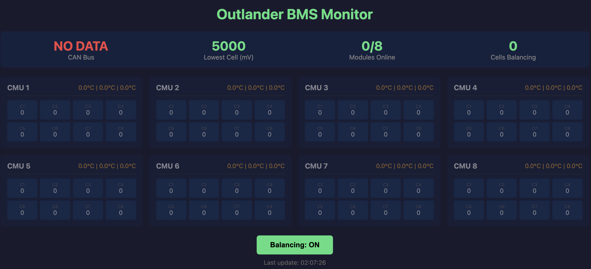

# Outlander PHEV BMS Reader for T-2Can

This is a port of the [OutlanderPHEVBMS](https://github.com/tomdebree/OutlanderPHEVBMS) project to PlatformIO for the LilyGo T-2Can board (ESP32-S3). 

The purpose is to read cell voltages and temperatures from Mitsubishi Outlander PHEV battery modules via CAN bus, providing a monitoring and management solution for DIY home energy storage systems built from dismantled Outlander PHEV batteries.

## Features

### Current Capabilities

- **CAN Bus Communication**: Reads data from up to 8 Outlander PHEV CMU (Cell Monitoring Units)
- **Cell Voltage Monitoring**: Tracks all 64 cells (8 cells per CMU × 8 CMUs)
- **Temperature Monitoring**: 3 temperature sensors per CMU
- **Cell Balancing Control**: Can enable/disable cell balancing
- **Web Dashboard**: Real-time monitoring via WiFi
- **Serial Console**: Interactive command interface

### V2 Features

- **SOC (State of Charge) Calculation**: 
  - Coulomb-counting (amp-hour integration) for accurate SOC tracking
  - Voltage-based fallback mode
  - Persistent SOC storage (survives reboots)
  - Manual SOC reset capability

- **Current Sensing**: 
  - Framework for dual-range analog sensors
  - CAN bus current sensor support (LEM, IsaScale, Victron)
  - Low-pass filtering for stable readings
  
- **Protection System**:
  - Overvoltage/undervoltage detection
  - Overtemperature/undertemperature monitoring
  - Cell imbalance warnings
  - Configurable thresholds and hysteresis

- **Pack Statistics**:
  - Min/max/average cell voltages
  - Min/max/average temperatures
  - Pack voltage calculation
  - Delta voltage tracking

- **ESS Control** (Energy Storage System):
  - Safe precharge sequencing (time + current threshold)
  - Main contactor engagement after precharge completion
  - Charger control integrated with protection system
  - ESS-only mode (stationary storage, not vehicle drive)
  - Automatic safety shutdown on protection faults

- **Enhanced Displays**:
  - Serial console shows SOC, current, pack voltage, temps
  - Web dashboard displays all V2 metrics
  - Detailed statistics view

## Hardware Requirements

- **LilyGO T-2Can board** (ESP32-S3)
- **Outlander PHEV battery modules** with CMUs
- **CAN bus connection** to the battery modules
- **Optional**: Current sensor (analog or CAN-based)

## ESS Wiring (ASCII Diagram)

Logic outputs are **active HIGH** (GPIO HIGH = output ON). Coils must be driven
through appropriate drivers/relays; GPIOs do not drive 12V directly.

```
                           +12V (coil supply)
                              |
                              +-------------------------------+
                              |                               |
                              |                         [Fuse]|
                              |                               |
                              |                         +--+  |
                              |                         |  |  |
                              |                         +--+  |
                              |                               |
                              |                               |
                           .--+--.                        .---+---.
                           |Main |                        |Prechg |
                           |Cont.|                        |Cont.  |
                           '-----'                        '-------'
                              |                               |
                              |                               |
                          OUT: IO15                       OUT: IO16
                          (MAIN)                          (PRECHG)
                              |                               |
                              +-----------+-------------------+
                                          |
                                      HV+ bus

HV- bus
  |
  +--> .-------.
      | Neg   |
      | Cont. |
      '-------'
          |
      OUT: IO17
      (NEG)

Charger enable (logic output): IO18 -> charger control input
Discharge enable (optional):   IO21 -> load enable input

Inputs (active HIGH):
  IO39 = AC_PRESENT
  IO41 = KEY_ON
  IO42 = AUX (optional)
```

## ESS Control Sequence

```
Time ---->

Inputs:
  AC_PRESENT / KEY_ON  ____|‾‾‾‾‾‾‾‾‾‾‾‾‾‾‾‾‾‾|____
  Protection OK        ‾‾‾‾‾‾‾‾‾‾‾‾‾‾‾‾‾‾‾‾‾‾‾‾

State:
  IDLE                 [IDLE]--------------------+
  PRECHARGE                                   [PRECHARGE]----+
  CONTACTOR_ON                                             [CONTACTOR_ON]

Outputs:
  NEG Contactor (IO17) ____|‾‾‾‾‾‾‾‾‾‾‾‾‾‾‾‾‾‾‾‾‾‾‾‾‾‾‾‾‾
  Precharge (IO16)     ____|‾‾‾‾‾‾‾‾‾‾|____________________
  Main Contactor (IO15)____|__________|‾‾‾‾‾‾‾‾‾‾‾‾‾‾‾‾‾‾‾
  Charger EN (IO18)    ____|__________|‾‾‾‾‾‾‾‾‾‾‾ (if allowed)

Precharge completes when BOTH are true:
  - elapsed time >= prechargeTimeMs
  - |current| <= prechargeCurrent (mA)

If a protection fault occurs, outputs drop and state goes to FAULT.
```

## Setup Instructions

### 1. Install PlatformIO

Follow the [T-2Can PlatformIO setup](https://github.com/Xinyuan-LilyGO/T-2Can?tab=readme-ov-file#platformio)

### 2. Configure WiFi

```bash
cp .config.h.template .config.h
# Edit .config.h and set your WiFi credentials
```

### 3. Build and Upload

```bash
cd t2can_port
pio run -t upload
```

### 4. Access the Dashboard

Once connected to WiFi, the serial console will display the IP address. Navigate to `http://<ip-address>/` in your browser to see the web dashboard.

## Web Dashboard

The web interface provides real-time monitoring of:
- State of Charge (SOC) percentage
- Pack voltage
- Current flow (charge/discharge)
- Individual cell voltages (color-coded)
- Temperature readings
- Cell balancing status
- Protection system status
- CAN bus connectivity



## Serial Commands

Connect via USB serial (115200 baud) and use these commands:

- `b` - Toggle cell balancing on/off
- `d` - Toggle debug mode (shows raw CAN frames)
- `R` - Reset SOC to 100%
- `s` - Show detailed statistics (all modules, cells, temps)
- `r` - Show what web server is showing
- `h` - Show help

## Configuration

Settings are defined in `src/bms_data.h` in the `BmsSettings` structure. Key parameters:

### Voltage Limits (per cell)
- `overVoltage` - Overvoltage fault threshold (default: 4.2V)
- `underVoltage` - Undervoltage discharge cutoff (default: 3.0V)
- `chargeVoltage` - Maximum charge voltage (default: 4.1V)
- `balanceVoltage` - Start balancing above this (default: 3.9V)

### Temperature Limits
- `overTemp` - Overheat fault (default: 65°C)
- `underTemp` - Cold limit (default: -10°C)

### Battery Configuration
- `seriesCells` - Cells in series (default: 12) - it works ok despite it is not true value
- `parallelStrings` - Parallel strings (default: 1)
- `capacityAh` - Battery capacity (default: 100Ah)

### SOC Configuration
- `useVoltageSoc` - Use voltage-based SOC instead of coulomb-counting
- `socVoltageCurve` - Voltage-to-SOC mapping [lowV_mV, lowSOC%, highV_mV, highSOC%]

### ESS Control (Precharge & Contactor)
- `prechargeTimeMs` - Minimum precharge duration (default: 5000ms)
- `prechargeCurrent` - Maximum current threshold for precharge completion (default: 1000mA)
- `contactorHoldDuty` - PWM duty cycle to hold contactor closed (default: 50%)

## ESS Control

The ESS (Energy Storage System) control module provides safe sequencing for stationary battery storage applications:

### Precharge Sequence
Precharge is a safety mechanism to gradually charge the DC link capacitors before engaging the main contactor:
- **Time Requirement**: Precharge relay must be active for at least `prechargeTimeMs` (default: 5 seconds)
- **Current Requirement**: Pack current must be below `prechargeCurrent` threshold (default: 1000mA = 1A)
- **Both conditions** must be satisfied before the main contactor engages

### Main Contactor Control
- Only engages after successful precharge completion
- Automatically disengages on any protection fault (overvoltage, undervoltage, overtemp, etc.)
- PWM hold mode reduces coil power consumption after initial engagement

### Charger Control
- Charger enable/disable is controlled by `protectionCanCharge()`
- Automatically disables on:
  - Overvoltage conditions
  - Overtemperature
  - Undertemperature (too cold to charge safely)
- Integrates with existing protection system

### Safety Features
- ESS-only mode (not for vehicle drive applications)
- All outputs automatically disabled on protection faults
- Non-blocking operation integrated with main loop timing
- Leverages existing CLI menu structure - no menu changes required

## Project Structure

```
t2can_port/
├── src/
│   ├── main.cpp           # Entry point, main loop
│   ├── config.h           # Hardware pins, constants
│   ├── bms_data.h/cpp     # Data structures, global state
│   ├── can_handler.h/cpp  # CAN bus communication
│   ├── serial_menu.h/cpp  # Serial console interface
│   ├── wifi_handler.h/cpp # WiFi management
│   ├── web_server.h/cpp   # Web dashboard
│   ├── soc_calc.h/cpp     # SOC calculation (V2)
│   ├── current_sense.h/cpp # Current sensing (V2)
│   ├── protection.h/cpp   # Protection system (V2)
│   └── ess_control.h/cpp  # ESS control (precharge, contactor, charger)
├── test/
│   ├── test_main.cpp      # Test entry point
│   ├── test_bms_data.cpp  # BMS data tests
│   ├── test_soc_calc.cpp  # SOC calculation tests
│   ├── test_protection.cpp # Protection system tests
│   ├── test_current_sense.cpp # Current sensing tests
│   ├── test_ess_control.cpp # ESS control tests
│   ├── test_safety_critical.cpp # Safety critical tests
│   └── mocks/             # Mock Arduino/Preferences for native tests
├── platformio.ini         # Build configuration
├── README.md              # This file
└── AGENTS.md              # Development notes

```

## Status

✅ **Working**: CAN communication, voltage/temp reading, web dashboard, serial interface
✅ **V2 Features**: SOC calculation, current sensing framework, protection system
⚠️ **Tested**: Software compiled and tested with WiFi; **CAN bus tested with real battery modules**
❌ **Not Implemented**: Physical current sensor integration, charger control (intentionally skipped)

## More Information

- See `AGENTS.md` for detailed development notes, hardware specifications, and CAN protocol documentation.
- See `../docs/REMOTE_LOGGING_PLAN.md` for comprehensive remote logging implementation plan with IoT standards and best practices.

## Credits

- Original project: [OutlanderPHEVBMS by tomdebree](https://github.com/tomdebree/OutlanderPHEVBMS)
- Hardware: [LilyGO T-2Can](https://github.com/Xinyuan-LilyGO/T-2Can)
- Development: AI-assisted port and enhancement
